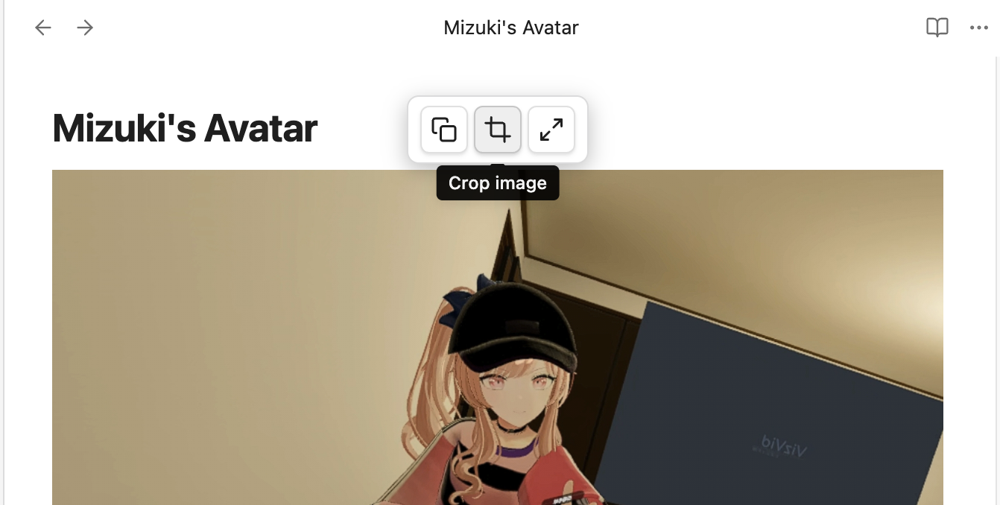

# Rin's Image Toolbar

Obsidian plugin that shows a floating toolbar when you hover over images in **Live Preview** mode.

## Features

- **Copy** — copy image to clipboard
- **Crop** — interactive crop dialog with drag handles and precise pixel input, saves as `filename_crop.ext` (auto-increment if exists)
- **Fullscreen** — view image in a fullscreen overlay

After cropping, the image reference in your note is **automatically updated** to point to the cropped version.

Reading view only shows Copy and Fullscreen (no crop).

## Demo



## Installation

1. Download the latest release from Releases
2. Extract into `.obsidian/plugins/image-toolbar/`
3. Enable "Image Toolbar" in Obsidian Settings → Community Plugins

## Manual Build

```bash
npm install
npm run build
```

## License

MIT
